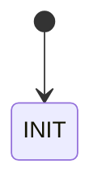

# BMS State Machine — Technical Write-Up

<!-- Scaffolding only. Every section below is yours to fill. -->

## 1. State Diagram

<!-- GitHub renders mermaid. Sketch the states and the condition on each edge. -->

## 2. States

<!-- One paragraph each: what the state does, what it allows, why it exists.
     Answers "What does each BMS state do, and why did you choose to include it?" -->

## 3. Architecture

<!-- Language and layout, why a hand-rolled machine rather than a library,
     how faults are represented and latched, where thresholds live.
     Answers "What algorithms or libraries did you use?" -->

## 4. Rules and Datasheet Basis

<!-- Which limit came from where. Sources already cited in bms/config.py:
     Li4P25RT datasheet rev A Table 1, and FSAE 2026 EV.5.6, EV.7.3-7.5, EV.9. -->

## 5. Testing

<!-- How sensor and driver inputs are simulated, what each test proves.
     Answers "How did you simulate driver and sensor inputs?" -->

## 6. Scaling

<!-- More cells, more sensors, more states. Table-driven transitions, per-cell
     data at real bus rates, distributed slave boards.
     Answers "How would you handle scaling this state machine?" -->

## 7. Repository

<!-- Link. -->
